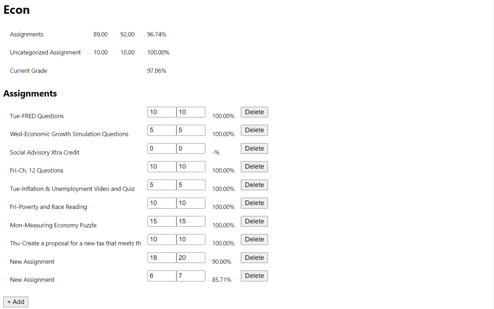

# Infinite Campus Grades++
A Chrome extension available on the [Chrome Web Store](https://chrome.google.com/webstore/detail/infinite-campus-grades%20%20/kfanojpgbklafmhammpnbajkkdpehign)!

Tired of the confusing Infinite Campus grade UI and having to manually calculating the lowest grade you can get on an assignment?

Worry no longer! This handy extension aims to address 2 crucial oversights of Infinite Campus, a confusing UI and the inability to simulate your grade.

With this extension, the assignments for each class are sorted neatly by grading category with your semester and category grades at the top of the page. Additionally, you can see how assignments will affect your grade by changing your score for past assignments, adding new assignments, or deleing past assignments!

Usage:
1. Make sure you are signed into [Infinite Campus](https://fremontunifiedca.infinitecampus.org/campus/portal/students/fremont.jsp)
2. After installing, click on the green Infinite Campus icon on the toolbar to open the home page
3. Here, you can see a list of your current classes
4. If you click on the "Open Class" link next to each class entry, you will be brought to the class page
5. Here, you can see all your assignments and grades:
   - Update assignment scores using the input boxes next to each assignment (or use the delete button to delete assignments)
   - Add assignments by pressing the add button at the bottom of each grading category
6. Your calculated grades will update in real time.
7. Enjoy!

Note: Calculated grades may be off by at most 0.01% due to rounding errors

For any bugs or feature requests, do not hesitate to email appdev.micro@gmail.com or open an issue on GitHub with a detailed description of the issue/feature.

