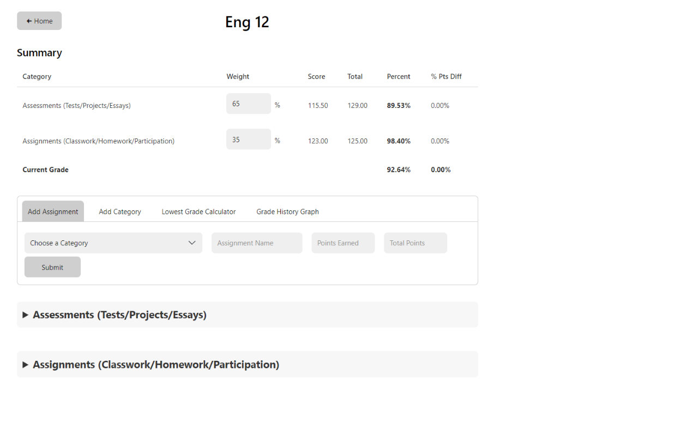
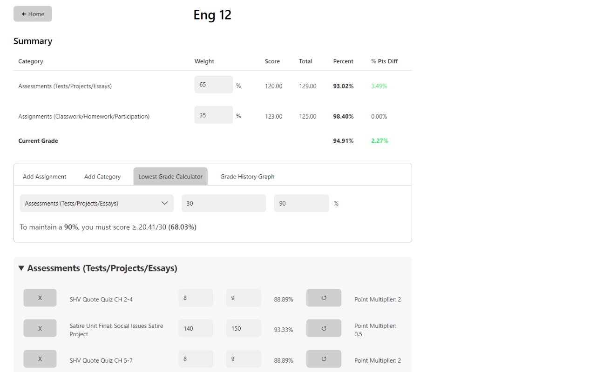
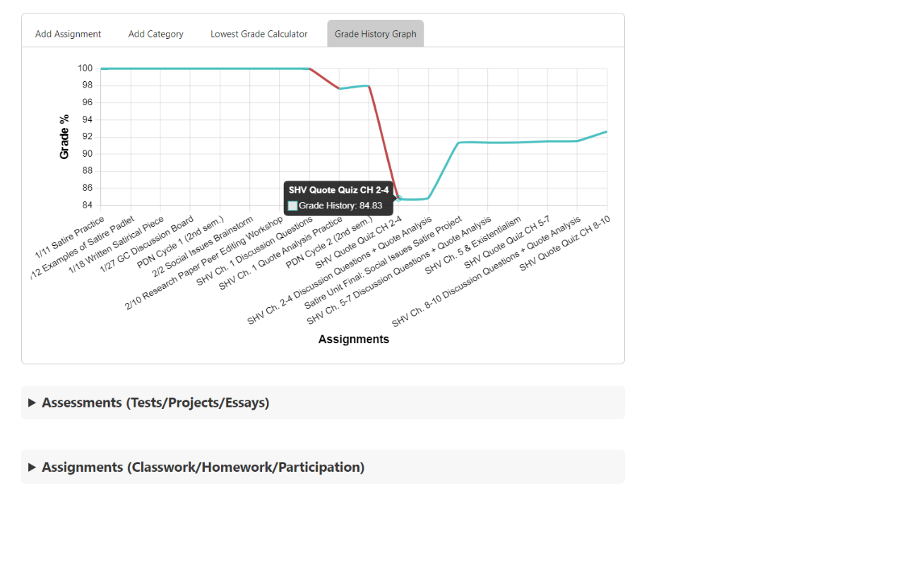
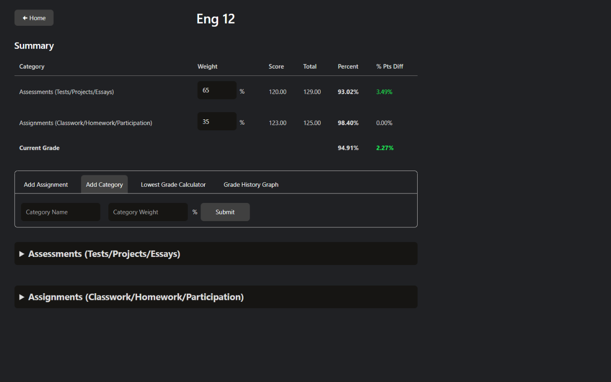

# Infinite Campus Grades++

A Chrome extension available on the [Chrome Web Store](https://chrome.google.com/webstore/detail/infinite-campus-grades%20%20/kfanojpgbklafmhammpnbajkkdpehign)!

Tired of the confusing Infinite Campus grades UI and having to manually calculate the lowest grade you can get on an assignment?

Worry no longer! This handy extension aims to address 2 crucial oversights of Infinite Campus, a confusing UI and the inability to simulate your grade.

Features:
- Assignments for each class are sorted neatly by grading category with your current grade and category grades at the top of the page
- Simulate your grade by changing your score for past assignments, adding new assignments, or deleting past ones
- Create new categories and change the weightage of existing ones
- Graph of how your grade has been changing throughout the semester
- Calculate the lowest grade you can get on an assignment to maintain a certain grade
- Light and Dark Mode

Usage:
1. Make sure you are signed in to [FUSD Infinite Campus](https://fremontunifiedca.infinitecampus.org/campus/portal/students/fremont.jsp)
2. After installing, click on the green Infinite Campus icon on the toolbar to open the home page
3. Here, you can see a list of your current classes and grades
   - You can change the semester you are viewing by clicking the radio buttons below the title
4. If you click on the "Open Class" button next to each class entry, you will be brought to the class page
5. Here, you can see all your assignments and grades for the class. You can:
   - Create new assignments and categories
   - Update assignment scores using the input boxes next to each assignment
   - Delete assignments using the "x" button
   - Reset assignments to their original score using the "⭯" button
   - Update category weightages using the input boxes in the summary table
6. The "Lowest Grade Calculator" tab allows you to calculate the lowest grade you can get on an assignment in order to maintain a certain grade
7. The "Grade History Graph" tab shows a graph of how your grade has changed during the semester
8. Enjoy!

Open Source libraries used: Chart.js and Water.css

Note: Calculated grades may be off by at most 0.01% due to rounding errors

For any bugs or feature requests, do not hesitate to email appdev.micro@gmail.com or open an issue on GitHub with a detailed description of the issue/feature.

### Images 

